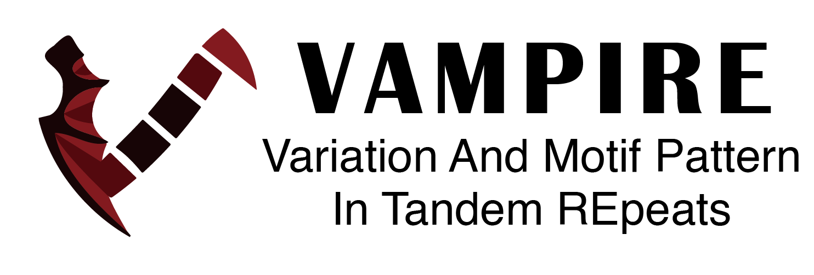

  

---

# **👋 Welcome to the VAMPIRE Cookbook**

**VAMPIRE** is an integrated tool for annotating motif variation and detecting complex patterns in tandem repeats.

You can find the source code, issue tracker, and development history on GitHub: 🔗 [VAMPIRE on GitHub](https://github.com/Zikun-Yang/VAMPIRE)

     

{: .highlight }
📦 Latest version: 0.3.0. See [Changelog](https://zikun-yang.github.io/VAMPIRE_Cookbook/docs/changelog.html) for release details.

---

